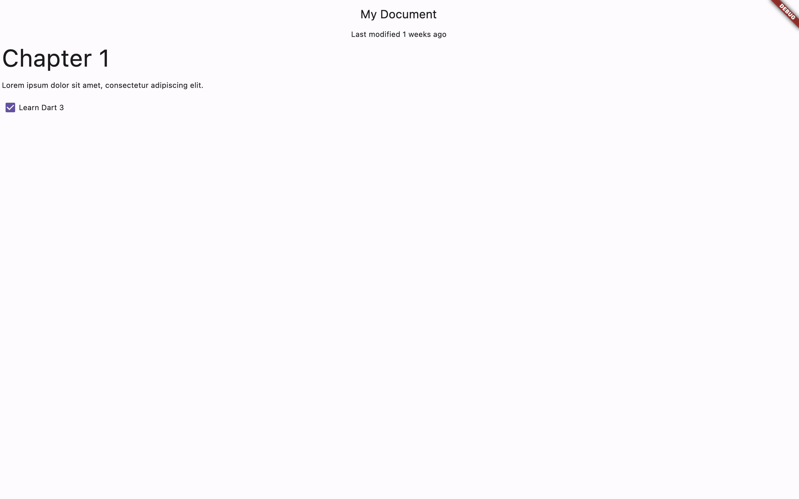
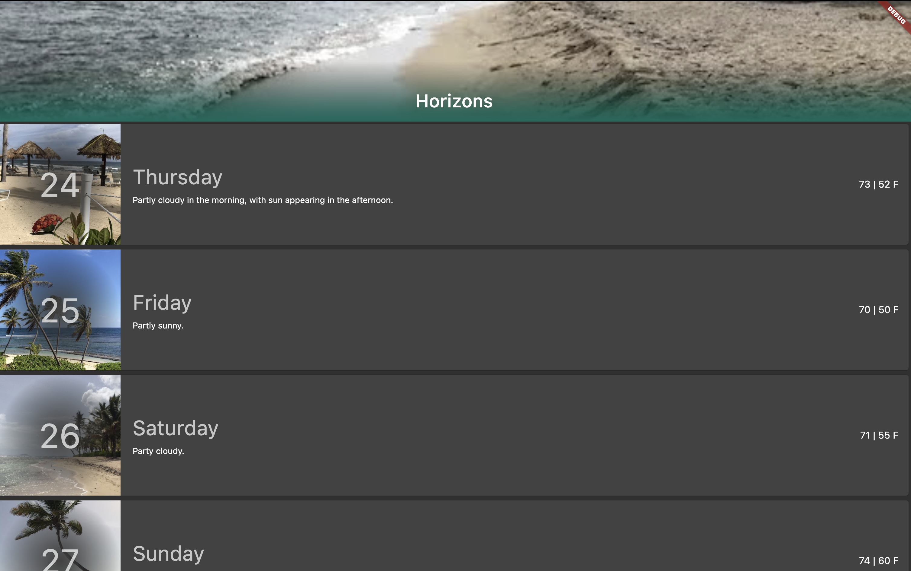

# flutter_codelabs

This repo implements all the code labs available for Flutter at https://codelabs.developers.google.com/?product=flutter

## Dive into Dart's patterns and records by John Ryan, Marya Belanger (patterns-codelab)

https://codelabs.developers.google.com/codelabs/dart-patterns-records#0

This codelab creates an application that displays a JSON document in Flutter. The application simulates JSON coming from an external source. The JSON contains document data such as the modification date, title, headers, and paragraphs. You write code to neatly pack data into records so that it can be transferred and unpacked wherever your Flutter widgets need it.

You then use patterns to build the appropriate widget when the value matches that pattern. You also see how to use patterns to destructure data into local variables.

## Building scrolling experiences in Flutter | Workshop (sliver-workshop)

https://www.youtube.com/watch?v=YY-_yrZdjGc
https://dartpad.dev/workshops.html?webserver=https://dartpad-workshops-io2021.web.app/getting_started_with_slivers

Learn how to build rich scrolling experiences in Flutter. We explore slivers and how they're different from other widgets in the framework. This Codelab requires just a browser, and we use DartPad to build our UI. An intermediate experience level with Flutter is recommended for this workshop.

